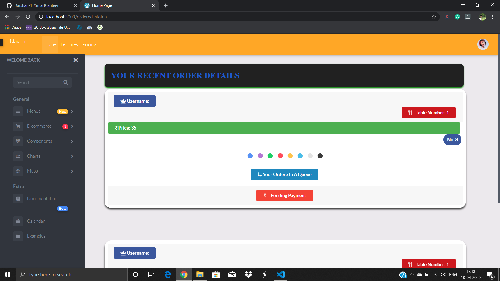

# Smart Canteen 🏭

# Introduction:

Smart Canteen as the name itself, we can decide to make our canteen digitalized and secure. Basically our plan is We have only got half an hour of Our lunch break, we will waste half an hour by stating in front of the counter. To eliminate this method we decided to build the software.

Our plan is we give a number to each bench available in the canteen, the buyers, or students go and sit on one bench and order the food to that bench by selecting the bench number in the web software.

There are two payment options is available in the software, 1. Cash on delivery(COD), 2. UPI. If you choose cash on delivery the request is sent to the canteen module, if the canteen head clicks on the paid button then your payment becomes success otherwise it will show the pending payment. Yes, you can order the food without playing the money also. It will show pending and you can pay the bill later also.

# Algorithms We Use:

# Design and Methodology

already we did some work on this project half of the projet is already completed another half is left

# Resource We Use
    Backend: Python libraries( flask, pandas, csv, cryptography, bcrypt, gridfs, pymongo for all mongodb operation)
    Frontend: HTML, CSS, JAVASCRIPT, BOOTSTRAP, MD BOOTSTRAP, SEMANTIC UI, GOOGLE charts
    Database: MongoDB
 
 # <b> There are three modules in our project </b>
        1. USERS MODULE
        2. CANTEEN MODULE
        3. ADMIN MODULE
   
    
  <b> 1. Users Module: </b>
  
  
  
  The above screenshot is users module. We deside to implement lot of feature in this project. main work is almost done some links are exist.
  In this module the user can order the food in the menue by selecting the bench number, quantity, and payment option. We give some authority to the users. The users can give the like and make the comment about the food. It will help the next person to is that food is good or not.
  
Behind the scene, Below Code can work 😀

👇🏻

      username = session['username']    
            purchased_item = request.form['purchased_item']
            item_count = request.form['item_count']
            item_url = request.form['Item_Url']
            item_price = request.form['item_price']
            total_price = int(item_price) * int(item_count)
            print (total_price,item_count,purchased_item)
            username = session['username']
            table_number = request.form['table_number']
            payment_method = request.form['payment_menthod']
            collage_name = session['clg_name']
            count = db.order_details.find().count()
            total_count = int(count) + 1
            print(total_count)
            order_status = "Waiting"
            if payment_method == 'COD':
                payment_status = "Pending"
                db.order_details.insert_one({"Username":username,"Table_Number":table_number,"Item_Url":item_url,"Order_Number":total_count,"Payment_Method":payment_method,"Purchased_Item":purchased_item,"Date":datetime.datetime.now(),"item_count":item_count,"Name_Of_Purchaser":username,"Collage_Name":collage_name,"Total_Price":total_price,"Payment_Status":payment_status,"Order_Status":order_status})
                if db.order_status.find({"status":"Waiting"}):
                    return redirect(url_for('ordered_status'))
            return redirect(url_for('payment'))
    if 'username' in session:
        all_items = db.canteen.find()
        return render_template("users.html",all_items=all_items)
    return "session timeout"
    

This is the ordered status of the purchaser, when they click on Buy button this window is pop up, There are three status in it
                
       1. Pending
       2. Accept
       3. Ready
 
 <b>1. Pending:</b>
 Pending status means your order in queue 
 
 <b> 2. Accept </b>
    Accept means your ordere is takened, It this time your food is cooking
  
  <b> Ready </b>
  Your food is ready or food is on the way

<b> 2. Canteen Module </b>
Canteen module is for all canteen related operation. In this module there are four submodule 
                                
               1. Payment 
               2. menue 
               3. recieved ordered 
               4. charts

<b> 1. Payment </b>
        This module consist off all payment realated information and hestory of all the payment
 
 <b> 2. Menue </b>
          In this module the authorized person can change or edit the menue, change the amount the food.
          
  <b> 3. Recieved order </b> 
            This module consist of all the orders recieved with its price and status of the payment. authorized person can see all the previous orders and print the bill by selecting the date.
            
  <b> 4. Charts </b> 
    The last module is charts, We decide to build something special in our project so we decide to add charts to our project. There are three charts are present 
    
    1. Food chart 
    2. Price Comparison chart 
    3. Best buyers chart.
    
  <b> 1. Food Chart: </b>
    This charts shows the quantity of each food purchased in a chart, It is easy to verify which product is more demand and which is not. It is also helps to improve the cooking level of the canteen and make more production of the food which are more demended.
    
   <b> 2. Price Comparison Chart </b>
        This charts shows the total amount of purchases of last one month in a line chart. It is easy to identify average income of the canteen. 
        
   <b> 3. Best buyers chart: </b>
   This charts shows the top 10 buyers of the canteen, with their purchaseed total price of the food, and top 5 most purchased food
   
   This module is not completed yet the half of the module is completed. If you found anything mistake or any suggtion you want give. you can free to say it.
   
Behind the scene, Below Code can work 😀

👇          

     @app.route("/canteen",methods=['GET','POST'])
    def canteen():
        if 'collage_name_session' in session:
            s = session['collage_name_session']
            print (s)
            if request.method == 'POST':
                collage_name = session['collage_name_session'] 
                Food_name = request.form['food_name']
                Food_price = request.form['food_price']
                item_pic = request.form['item_pic']
                test_food = db.canteen.find_one({"Food_Name":Food_name,"Collage_Name":collage_name})
                if test_food is None:
                    db.canteen.insert_one({"Collage_Name":collage_name,"Food_Name":Food_name,"Food_Price":Food_price,"Item_Pic":item_pic})
                    return redirect(url_for("canteen"))
                return "food name is already exist"
            items = db.canteen.find({"Collage_Name":s})
            return render_template("canteen.html",clg_name = s,items=items)
        return '''
    <h3> session timeout </h3>
    '''
    
    @app.route("/ordered_status")
    def ordered_status():
        if 'username' in session:
            username = session['username']
            order_details = db.order_details.find({"Username":username})
            return render_template("order_status.html",order_status=order_details)
        return redirect(url_for("session_timeout"))
        
    @app.route("/delete_item",methods=['POST'])
    def delete_items():
        delete_id = request.form['deletable_item']
        print(delete_id)
        db.canteen.remove({"Food_Name":delete_id})
        return redirect(url_for('canteen',alert = delete_id))

    
        
  
